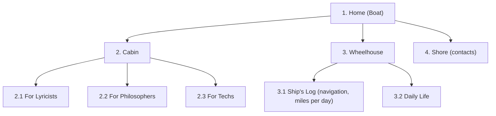

# Структура проекта Ulysses

Живой чертёж корабля: карта разделов сайта и дерево файлов.
Меняется вместе с проектом — спорить и править приветствуется.

## Карта сайта

Одностраничник (SPA): один `index.html`, разделы переключает JavaScript.



Заметки с мостика:
- Лирик-технарь заходит в обе каюты — разделы не взаимоисключающие.
- На «Берегу» живёт особая кнопка (пасхалка — позже).

## Дерево файлов

```text
ULYSSES/
├── content/
│   ├── index.json       # манифест: список всех записей с метаданными
│   └── ru/              # записи на русском (позже — en/, pl/)
├── css/
│   └── style.css        # базовая вёрстка и морская палитра
├── docs/
│   └── structure.md     # этот файл: карта и дерево
├── img/
│   └── .gitkeep         # placeholder, чтобы пустая папка попала в git
├── js/
│   └── main.js          # точка входа (ES-модуль)
├── index.html           # каркас SPA: шапка, навигация, 4 раздела
├── README.md            # манифест (английский)
└── README.ru.md         # оригиналы стихов и манифест (русский)
```

## Контент

Контент живёт отдельно от кода, в `content/`. Формат — **JSON**.

- `content/index.json` — манифест: массив записей с метаданными
  (`title`, `date`, `section`, `file`). Браузер не умеет читать папки —
  этот файл и есть «оглавление» библиотеки.
- Сам текст записи — отдельный JSON-файл, стих хранится как **массив строк**
  (`"text": ["строка раз,", "строка два..."]`): никаких `\n`, пишется руками,
  посредник не нужен — добавить запись можно и без интернета на борту.
- Переводы — рядом: `content/ru/`, потом `content/en/`, `content/pl/`.

### Появится по мере надобности (пока не заводим)

```text
├── img/                 # logo, фото, фоны — по мере появления
├── videos/              # видео (тяжёлое для слабого интернета на борту)
├── documents/           # PDF и прочие файлы
├── robots.txt           # инструкции поисковым роботам
└── sitemap.xml          # карта сайта для индексации
```
