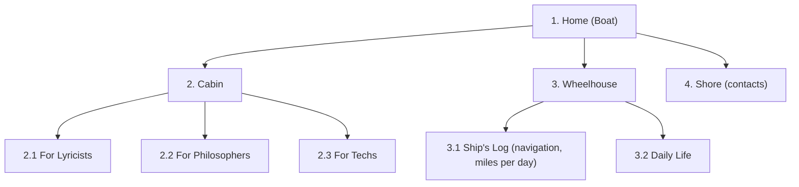

# Структура проекта Ulysses

Живой чертёж корабля: карта разделов сайта и дерево файлов.
Меняется вместе с проектом — спорить и править приветствуется.

## Карта сайта

Одностраничник (SPA): один `index.html`, разделы переключает JavaScript.



Заметки с мостика:
- Лирик-технарь заходит в обе каюты — разделы не взаимоисключающие.
- На «Берегу» живёт особая кнопка (пасхалка — позже).

## Дерево файлов

```text
ULYSSES/
├── content/
│   ├── index.json       # манифест: список всех записей с метаданными
│   ├── ru/              # всё на русском: ui.json + стихи, записи…
│   │   ├── ui.json
│   │   └── baltika-zhdet.json
│   └── en/              # всё на английском (позже pl/)
│       └── ui.json
├── css/
│   └── style.css        # базовая вёрстка и морская палитра
├── docs/
│   └── structure.md     # этот файл: карта и дерево
├── img/
│   └── .gitkeep         # placeholder, чтобы пустая папка попала в git
├── js/
│   └── main.js          # точка входа (ES-модуль)
├── index.html           # каркас SPA: шапка, навигация, 4 раздела
├── README.md            # манифест (английский)
└── README.ru.md         # оригиналы стихов и манифест (русский)
```

## Контент

Контент живёт отдельно от кода, в `content/`. Формат — **JSON**.

- `content/index.json` — манифест: массив записей с метаданными
  (`title`, `date`, `section`, `file`). Браузер не умеет читать папки —
  этот файл и есть «оглавление» библиотеки.
- Сам текст записи — отдельный JSON-файл, стих хранится как **массив строк**
  (`"text": ["строка раз,", "строка два..."]`): никаких `\n`, пишется руками,
  посредник не нужен — добавить запись можно и без интернета на борту.
- Переводы — по папкам языка: `content/ru/`, `content/en/`, позже `content/pl/`.
  **Язык всегда в имени папки** — и для UI, и для стихов. Одна схема, не надо
  вспоминать.

### Интерфейс (i18n)

Видимый текст **не живёт** в `index.html` — только разметка-оболочка с
атрибутами `data-i18n="ключ"`. Строки интерфейса лежат рядом с контентом
того же языка:

- `content/ru/ui.json` — русский интерфейс
- `content/en/ui.json` — английский
- позже `content/pl/ui.json` — польский

JS: `fetch(\`content/${lang}/ui.json\`)` — тот же шаблон пути, что и для
стихов: `content/${lang}/имя-файла.json`.

JS загружает нужный файл, подставляет текст в элементы с `data-i18n`,
обновляет `<title>`, `<meta name="description">`, `aria-label` навигации
и атрибут `lang` на `<html>`. Переключатель RU/EN в шапке.

### Типы записей

Ulysses — порт приписки для всего флота (тексты, песни, видео, книги),
разбросанного по чужим платформам (YouTube, Spotify, Литрес…).
Поэтому у записи есть тип и, для внешнего контента, ссылка.

- `"type"` — тип записи: `стих` / `песня` / `видео` / `книга`.
- `"url"` — ссылка на внешний источник (для песни/видео/книги).
  У стиха ссылки нет — есть `"text"`. У видео/трека наоборот.

Правило роста: схему растит самое частое действие, а не фантазия о будущем.
Новые поля и типы добавляем тогда, когда они реально нужны, по одному.

### Появится по мере надобности (пока не заводим)

```text
├── img/                 # logo, фото, фоны — по мере появления
├── videos/              # видео (тяжёлое для слабого интернета на борту)
├── documents/           # PDF и прочие файлы
├── robots.txt           # инструкции поисковым роботам
└── sitemap.xml          # карта сайта для индексации
```
